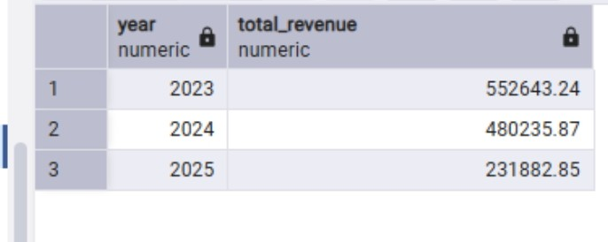

📊 Project Description

This project is a SQL-based data analysis case study focused on exploring and extracting business insights from a sales dataset. The objective was to clean, transform, and analyze raw transactional data in order to understand customer behavior, revenue performance, and overall business trends.

Using SQL, the dataset was explored to identify missing values, detect duplicates, and perform key aggregations such as total revenue, customer spending patterns, monthly and yearly sales trends, payment method distribution, and coupon usage effectiveness.

The analysis was structured to simulate real-world business reporting, helping to translate raw data into meaningful insights that support data-driven decision-making.

     📌 Data Cleaning & Preparation

Before performing analysis, the dataset was cleaned and prepared to ensure accuracy, consistency, and reliability of insights.

     🔹 1. Handling Missing Values

Missing values were identified in key columns such as customer_id, product_name, and total_amount.

Records with missing critical identifiers were removed
For non-critical fields, missing values were replaced where appropriate

Why this matters:
Ensures analysis is not biased or incomplete due to missing data.

     
     🔹 2. Removing Duplicates

Duplicate records were checked and removed to avoid inflating sales or transaction counts.

SELECT DISTINCT *
FROM sales;

Why this matters:
Prevents overestimation of revenue and incorrect business conclusions.

     🔹 3. Standardizing Data Formats

Inconsistent formats were corrected:

Dates were standardized to YYYY-MM-DD
Text fields (e.g., product names, payment methods) were cleaned for consistency (trimmed spaces, unified casing)
UPDATE sales
SET payment_method = TRIM(LOWER(payment_method));

Why this matters:
Ensures grouping and filtering work correctly in analysis.

     🔹 4. Fixing Data Types

Columns such as total_amount and quantity were converted to correct numeric formats where necessary.

Why this matters:
Prevents calculation errors during aggregation (SUM, AVG, etc.).

     🔹 5. Handling Outliers (if applicable)

Extreme values were reviewed to ensure they were valid transactions and not data entry errors.

Why this matters:
Outliers can distort averages and trends.

     🔹 6. Final Clean Dataset

After cleaning, a structured dataset was used for analysis in SQL, Excel, and visualization tools.
🔍 Key Insights

      💰 Revenue Performance
The dataset shows consistent revenue generation across customers, with a small group of customers contributing a significantly higher share of total revenue.
Overall revenue trends indicate periods of strong sales performance, with noticeable variation across different months and years.

      🧑‍🤝‍🧑 Customer Behavior
A few high-value customers account for a large portion of total revenue, indicating the presence of top-spending loyal customers.
Most customers fall into a lower spending range, suggesting opportunities for targeted marketing and customer retention strategies.

      📅 Time-Based Trends
Monthly and yearly analysis reveals fluctuations in sales performance, highlighting peak sales periods.
Certain months consistently perform better, indicating possible seasonal buying behavior.

      💳 Payment Method Analysis
Some payment methods are used more frequently than others, showing customer preference trends.
Certain payment channels generate higher revenue, making them more valuable for business focus.

      🎟️ Coupon / Discount Impact
Coupon usage varies across transactions, with some codes generating higher revenue than others.
Discounts appear to influence customer purchasing behavior, but not all coupons contribute equally to revenue growth.

      📌 Conclusion
This project demonstrates how SQL can be used to transform raw sales data into actionable business insights. The analysis provides a foundation for understanding customer segmentation, revenue drivers, and sales trends, which are essential for making informed business decisions.

  ## Analysis Outputs

### Total Revenue

### Yearly Sales Analysis

### Customer Revenue Analysis

### Payment Method Analysis

### Coupon Analysis

